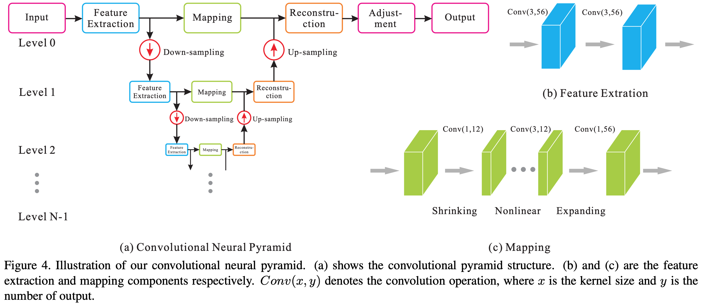

# CNP

#### Title
[Convolutional Neural Pyramid for Image Processing](https://arxiv.org/abs/1704.02071)

#### Abstract
We propose a principled convolutional neural pyramid (CNP) framework for general low-level vision and image processing tasks. It is based on the essential finding that many applications require large receptive fields for structure understanding. But corresponding neural networks for regression either stack many layers or apply large kernels to achieve it, which is computationally very costly. Our pyramid structure can greatly enlarge the field while not sacrificing computation efficiency. Extra benefit includes adaptive network depth and progressive upsampling for quasi-realtime testing on VGA-size input. Our method profits a broad set of applications, such as depth/RGB image restoration, completion, noise/artifact removal, edge refinement, image filtering, image enhancement and colorization.

## Data Generation
* Before running Train phase, execute **run_make_database.py** to generate dataset. 

## Train
    $ python main.py --mode train \
                     --scope [scope name] \
                     --name_data [data name] \
                     --dir_data [data directory] \
                     --dir_log [log directory] \
                     --dir_checkpoint [checkpoint directory]
                     --gpu_ids [gpu id; '-1': no gpu, '0, 1, ..., N-1': gpus]
---
    $ python main.py --mode train \
                     --scope unet \
                     --name_data em \
                     --dir_data ./datasets \
                     --dir_log ./log \
                     --dir_checkpoint ./checkpoint
                     --gpu_ids 0

* Set **[scope name]** uniquely.
* To understand hierarchy of directories based on their arguments, see **directories structure** below. 
* Hyperparameters were written to **arg.txt** under the **[log directory]**.

## Test
    $ python main.py --mode test \
                     --scope [scope name] \
                     --name_data [data name] \
                     --dir_data [data directory] \
                     --dir_log [log directory] \
                     --dir_checkpoint [checkpoint directory] \
                     --dir_result [result directory]
                     --gpu_ids [gpu id; '-1': no gpu, '0, 1, ..., N-1': gpus]
---
    $ python main.py --mode test \
                     --scope unet \
                     --name_data em \
                     --dir_data ./datasets \
                     --dir_log ./log \
                     --dir_checkpoint ./checkpoints \
                     --dir_result ./results
                     --gpu_ids 0

* To test using trained network, set **[scope name]** defined in the **train** phase.
* Generated images are saved in the **images** subfolder along with **[result directory]** folder.
* **index.html** is also generated to display the generated images.  
